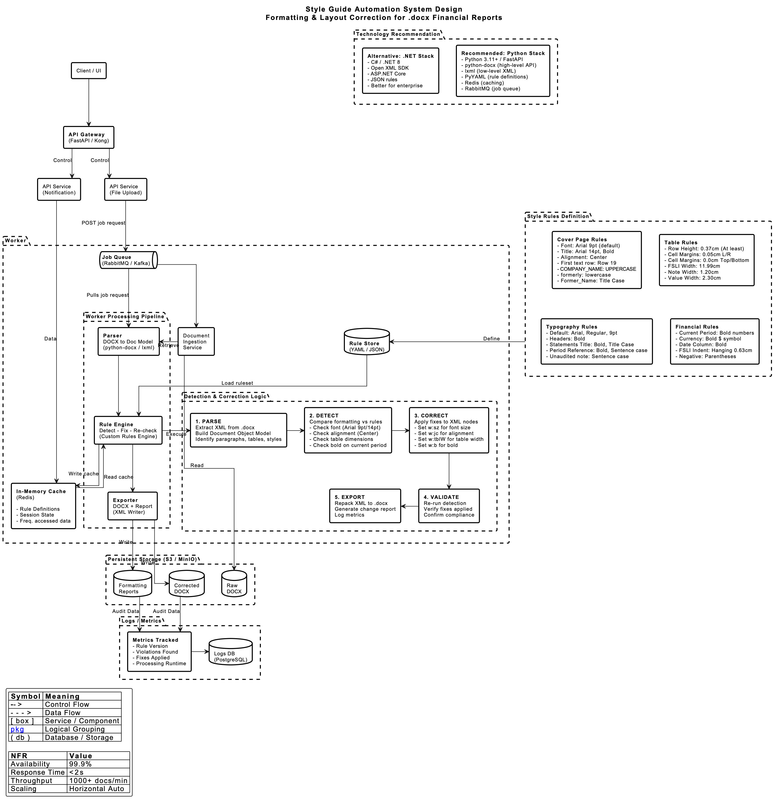
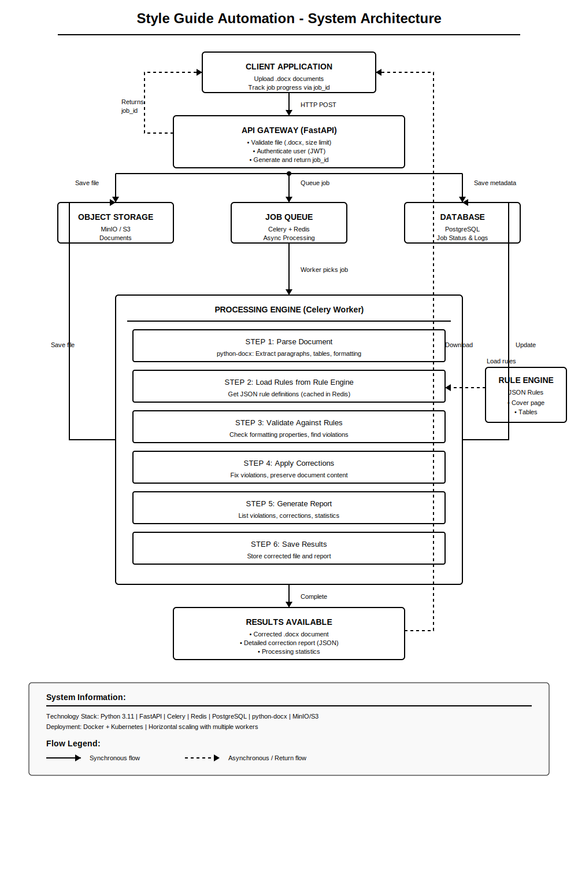
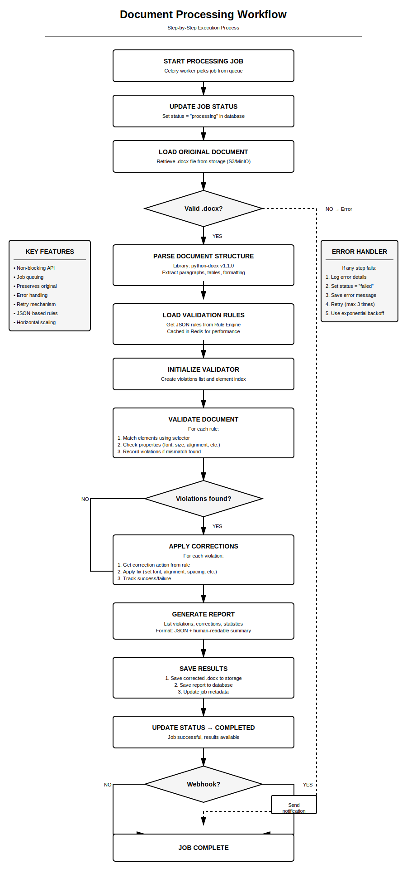

# Style Guide Automation - System Design
---

## Overview

This document describes how I'd build the style guide automation system. After doing all the research (see the research document), I've settled on an architecture that I think strikes a good balance between simplicity and functionality.

The core idea is straightforward: users upload Word documents through an API, the system checks them against configurable rules, automatically fixes any violations, and returns a corrected document with a detailed report of what changed. But there's quite a bit of interesting design work in how that actually happens.

---

## The Big Picture Architecture

Let me start with the high-level view, then we'll dig into specifics.

### System Architecture Overview

Here's the complete system design that shows how all the pieces fit together:



*Figure 1: Complete system architecture showing the flow from client to storage, including the Worker Processing Pipeline, Style Rules Definition, and Detection & Correction Logic.*

A few things to notice in this diagram:

- **Left side**: The client-facing components (API Gateway, API Services)
- **Center**: The Worker section where all the heavy lifting happens
- **Right side**: Style Rules Definition - these are the actual formatting rules from the BestCo style guide
- **Bottom**: Persistent storage and observability

The key insight is that it's asynchronous - the API returns immediately with a job ID, then processing happens in the background. Users can check status, download when done, or get notified via webhook. This is a much better user experience than making them wait 1-2 minutes for a synchronous response.

### Processing Workflow Flowchart

For a more detailed look at the processing steps, here's the flowchart view:



*Figure 2: Detailed flowchart showing the exact processing steps from document upload to corrected output.*

This flowchart captures:
- How the API Gateway validates files and authenticates users
- The exact processing steps (parse → load rules → validate → correct → report)
- How data flows between components
- Where rules come from (JSON configuration files)
- Storage locations for original documents, corrected documents, and metadata
- Timing information (processing takes ~1-2 minutes total)
- How the system scales (horizontal worker scaling, Redis caching)

---

## Job Processing Flow

Understanding how a single job moves through the system is important. Here's the sequence diagram that shows the complete lifecycle:

.png)

*Figure 3: Sequence diagram showing the complete job lifecycle from user upload to completion notification.*

Let me walk through what's happening here:

### Submit Job Phase
1. User uploads a DOCX file through the Client/UI
2. Request goes through API Gateway to the API Service
3. File gets stored in Object Storage (S3/MinIO)
4. Job gets queued in RabbitMQ/Kafka
5. User immediately gets back a 202 Accepted with their job ID

This is the key UX insight - the user doesn't wait. They get their job ID in milliseconds and can go do other things.

### Worker Processing Phase
1. Worker pulls the next job from the queue
2. Checks cache first (maybe we've processed this exact document before?)
3. If cache miss, retrieves the raw DOCX from storage
4. Loads the ruleset from the Rule Store
5. Runs the core pipeline: Parse → Detect → Fix → Re-check
6. Exports the corrected DOCX and formatting report
7. Stores both in Object Storage
8. Caches the result for future identical documents
9. Logs all the metrics (violations found, fixes applied, runtime)

### Completion Phase
1. Job status gets updated to COMPLETED
2. User gets notified (webhook, email, or they poll for status)
3. User can download their corrected document

The beauty of this flow is that each component has a single responsibility. The API doesn't know about document parsing. The Worker doesn't know about HTTP requests. Everything is decoupled.

---

## Data Models

To understand how the system represents documents and rules internally, here's the class diagram:

.png)

*Figure 4: Class diagram showing the data models for Jobs, Rules, Documents, and their relationships.*

### Key Classes Explained

**Job-related classes (left side):**
- `Job`: Tracks a processing job with status, timestamps, and file references
- `JobStatus`: Enum for QUEUED, RUNNING, COMPLETED, FAILED
- `FormattingReport`: Contains all violations found and fixes applied
- `Violation`: A single formatting issue with severity, message, and location

**Rule-related classes (center):**
- `Ruleset`: A versioned collection of rules
- `Rule`: A single formatting rule with selector, assertions, and fix actions
- `RuleScope`: Enum for COVER_PAGE, TABLES_GLOBAL, FIN_POSITION_VALUE_COLS, TYPOGRAPHY
- `Selector`: How to find elements (by type, by query)
- `Assertion`: What to check (property, expected value, comparator)
- `FixAction`: How to fix violations (SET_FONT, SET_ALIGNMENT, SET_ROW_HEIGHT, etc.)

**Document model classes (right side):**
- `DocumentModel`: The parsed representation of a DOCX file
- `Section`: A logical section of the document
- `TableModel`: A table with columns, rows, and cell margins
- `ParagraphModel`: A paragraph with text, alignment, and runs
- `RunModel`: A run of text with consistent formatting (font, size, bold, etc.)

This model is flexible enough to handle the BestCo style guide rules while being simple enough to implement cleanly. The key insight is separating the "what to check" (Assertions) from the "how to fix" (FixActions).

---

## The Detection & Correction Logic

This is the heart of the system. Let me zoom in on how detection and correction actually work:



*Figure 5: Detailed workflow showing the Parse → Detect → Correct → Validate → Export pipeline.*

### Step 1: PARSE
- Extract XML from the .docx file (it's actually a ZIP of XML files)
- Build a Document Object Model from the XML
- Identify all paragraphs, tables, and styles
- Map the structure to our internal DocumentModel

### Step 2: DETECT
- Load the ruleset (cached in Redis for performance)
- For each rule, find matching elements using the selector
- Check each element against the rule's assertions
- Compare current formatting vs expected formatting
- Record violations with location, severity, and details

### Step 3: CORRECT
- For each violation, look up the corresponding fix action
- Apply fixes to the XML nodes directly:
  - `w:sz` for font size
  - `w:jc` for alignment
  - `w:tblW` for table width
  - `w:b` for bold
- Preserve document structure while modifying properties

### Step 4: VALIDATE
- Re-run detection on the corrected document
- Verify that fixes were actually applied
- Catch any fixes that didn't take (rare but possible)
- Confirm compliance with the ruleset

### Step 5: EXPORT
- Repack the modified XML back into a .docx file
- Generate the formatting report (JSON with all changes)
- Log metrics for observability
- Store outputs in Object Storage

---

## Breaking Down the Components

### API Gateway

This is the entry point. I'm thinking FastAPI here because it's modern, has good async support, and auto-generates documentation. Plus it's what I'm familiar with.

Main responsibilities:
- Accept document uploads (multipart form data)
- Validate the file is actually a .docx
- Check file size (let's say 50MB limit to avoid abuse)
- Authenticate the user (JWT tokens probably)
- Generate a job ID
- Store the original document
- Queue the processing job
- Return immediately with the job ID

Users shouldn't have to wait while processing happens. That's why we return right away - they get their job ID, they can go do other things, check back later or set up a webhook.

I'd also add endpoints for:
- Checking job status
- Downloading the corrected document
- Getting the correction report
- Canceling a job if needed
- Listing available rule sets

Nothing fancy, just standard REST API design.

### Document Parser

This is where python-docx comes in. The parser's job is to read the .docx file and extract all the formatting information we care about.

A .docx file has a structure: paragraphs, runs (chunks of text with consistent formatting), tables, rows, cells. We need to walk through all of that and build an internal representation that we can check against rules.

The tricky part is handling the structure correctly. A single paragraph might have multiple runs with different formatting. Tables can be nested. There are sections with different page layouts. We need to preserve all that information.

I'd build a simple internal model - something like:

```python
class ParsedDocument:
    paragraphs: List[Paragraph]
    tables: List[Table]
    
class Paragraph:
    text: str
    alignment: str  # left, center, right
    runs: List[Run]
    position: int  # which paragraph number
    
class Run:
    text: str
    font_name: str
    font_size: float
    bold: bool
    # ... other properties
```

This gives us a clean way to navigate the document structure without dealing with python-docx internals everywhere.

### Rule Engine

This is probably the most interesting part design-wise. Instead of hardcoding "company names must be Arial 14pt bold centered", I want rules defined in JSON files. This means when the style guide changes, you just update a JSON file - no code deployments.

A rule looks something like this:

```json
{
  "rule_id": "cover_page_title_alignment",
  "description": "Company name line must be centered",
  
  "selector": {
    "element_type": "paragraph",
    "contains_text": "formerly",
    "position": "first_20_paragraphs"
  },
  
  "checks": [
    {
      "property": "alignment",
      "expected": "center",
      "severity": "error"
    },
    {
      "property": "font_name",
      "expected": "Arial"
    },
    {
      "property": "font_size",
      "expected": 14
    }
  ],
  
  "corrections": [
    {
      "action": "set_alignment",
      "value": "center"
    },
    {
      "action": "set_font",
      "font_name": "Arial",
      "font_size": 14,
      "bold": true
    }
  ]
}
```

Breaking this down:
- **Selector**: How to find the elements this rule applies to
- **Checks**: What to validate about those elements
- **Corrections**: How to fix violations

The rule engine loads these from JSON files, parses them, and provides them to the validator. I'd probably cache them in memory since they don't change often.

I'm also thinking about rule versioning. When you update rules, you want to track what changed and when. So each rule set would have a version number, and we'd store the history. This is important for audit purposes - you need to know what rules were in effect when a document was processed.

### Validator

The validator takes the parsed document and the rules, then systematically checks for violations.

Here's roughly how it would work:

```python
def validate_document(document, rules):
    violations = []
    
    for rule in rules:
        # Find elements matching the selector
        elements = find_matching_elements(document, rule.selector)
        
        # Check each element
        for element in elements:
            for check in rule.checks:
                actual_value = get_property(element, check.property)
                
                if actual_value != check.expected:
                    violations.append({
                        'rule_id': rule.rule_id,
                        'element': element,
                        'property': check.property,
                        'expected': check.expected,
                        'actual': actual_value
                    })
    
    return violations
```

The selector logic is where it gets interesting. We need to support various ways of finding elements:
- By type (paragraph, table, run)
- By content (contains text "formerly")
- By position (first 20 paragraphs, row 19)
- By context (inside a table, in the cover page section)

I'd build this incrementally - start with simple selectors, add complexity as needed.

### Corrector

Once we have violations, we need to fix them. The corrector applies the corrections defined in each rule.

```python
def apply_corrections(document, violations, rules):
    for violation in violations:
        rule = get_rule(violation.rule_id)
        element = violation.element
        
        for correction in rule.corrections:
            apply_correction(element, correction)
    
    return document
```

The `apply_correction` function handles the specifics of each action type. Setting font properties, changing alignment, adjusting table dimensions - each requires different python-docx calls.

One important consideration: corrections might interact. If one rule changes font size and another changes line spacing, the order might matter. I'd probably apply corrections in rule priority order and log any conflicts.

### Report Generator

After corrections are applied, we generate a detailed report showing what changed. This is crucial for user trust - they need to see exactly what the system did to their document.

The report would include:
- List of all violations found
- For each violation: what was wrong, what was expected, what we changed
- Summary statistics (X violations found, Y corrected, Z failed)
- Processing metadata (time taken, rule version used)

I'd generate this as JSON (for programmatic use) and optionally as a formatted summary (for human reading).

---

## The Style Rules (From BestCo Assignment)

Based on the actual assignment requirements, here are the specific rules the system needs to enforce:

### Cover Page Rules
- **Font**: Arial 9pt (default), Arial 14pt for title
- **Alignment**: Center
- **First text row**: Row 19 from top
- **COMPANY_NAME**: UPPERCASE
- **"formerly"**: lowercase
- **Former_Name**: Title Case

### Table Rules
- **Row Height**: 0.37cm (At least)
- **Cell Margins**: 0.05cm Left/Right, 0.0cm Top/Bottom
- **FSLI Width**: 11.99cm
- **Note Width**: 1.20cm
- **Value Width**: 2.30cm

### Typography Rules
- **Default**: Arial, Regular, 9pt
- **Headers**: Bold
- **Statements Title**: Bold, Title Case
- **Period Reference**: Bold, Sentence case
- **Unaudited note**: Sentence case

### Financial Rules
- **Current Period**: Bold numbers
- **Currency**: Bold $ symbol
- **Date Column**: Bold
- **FSLI Indent**: Hanging 0.63cm
- **Negative numbers**: Parentheses

These rules are all configurable via JSON, so when the style guide changes, we just update the rule definitions - no code changes needed.

---

## Design Decisions

Let me explain some of the key choices I made:

### Why JSON Rules Instead of Hardcoding?

I could have written something like:

```python
if paragraph.contains('formerly'):
    if paragraph.alignment != 'center':
        fix_alignment(paragraph)
```

This would work, and it would be simpler initially. But six months from now when the style guide changes, you'd need a developer to update the code, test it, deploy it. With JSON rules, a business analyst can update them without touching code.

Yes, it's more complex upfront. You need a rule parser, a selector engine, a way to apply generic corrections. But it pays off in maintainability. And it makes the system more flexible - you can have different rule sets for different document types or business units.

### Why Asynchronous Processing?

Documents can take a minute or two to process. If the API call was synchronous, the user would sit there waiting, their HTTP connection would be open, they'd wonder if it was working.

With async processing, we return immediately with a job ID. The user can close their browser, do something else, check back later. It's a much better user experience.

The cost is complexity - you need a queue (Celery/Redis), you need job tracking in a database, you need status checking endpoints. But this is standard practice for any long-running operation, so there are well-established patterns to follow.

### Why Generate a New Document Instead of Modifying In Place?

I considered modifying the original document directly, but decided against it. Here's why:

If we generate a new corrected document, we keep the original intact. This is safer - if something goes wrong, we haven't lost the original. It also allows before/after comparison, which builds trust. Users can see exactly what changed.

The downside is we're storing two copies of each document (original and corrected). Storage is cheap though, and we can have a retention policy (delete after 30 days or whatever).

### Why python-docx Instead of Automating Word?

Some document automation solutions actually spin up Microsoft Word on a server and automate it programmatically. This works, but it's a nightmare to manage in production. You're running GUI applications on servers, dealing with licensing, handling crashes, managing resources.

Libraries like python-docx give us what we need without all that overhead. The trade-off is we can't handle every possible Word feature, but for our use case, we don't need to.

### Why Not Just Use a Template?

For generating new documents, templates make sense. But we're correcting existing documents. The content is already there, the structure is already defined. We're just fixing formatting.

Templates would require extracting all the content from the original document, then regenerating it using the template. That's more complex and error-prone than just fixing the formatting in place.

---

## Handling Edge Cases

Real-world documents have all sorts of unexpected scenarios. Here's how I'd handle some of them:

**Corrupted documents**: If python-docx can't parse the file, return an error immediately. Don't waste time trying to process it.

**Very large documents**: For documents over 100 pages, maybe send a warning that processing will take longer. Or split the processing into chunks. Or just accept that it'll take 5 minutes instead of 2.

**Conflicting rules**: What if two rules contradict each other? I'd add a priority system. Higher priority rules win. And document this clearly in the rule authoring guide.

**Missing fonts**: If a document uses a font that's not available, what happens? python-docx will use a fallback. Log a warning but keep going.

**Complex table structures**: Nested tables, merged cells - these can be tricky. Test thoroughly with real examples. If we can't handle something, log it and skip that correction rather than failing completely.

**Unexpected formatting**: Sometimes documents have unusual formatting we didn't anticipate. The system should be defensive - if a correction fails, log it, mark it as failed, but continue with other corrections.

---

## Scalability

How would this handle growth?

**API Layer**: FastAPI is async, so it can handle lots of concurrent requests efficiently. If needed, run multiple API instances behind a load balancer. Pretty standard.

**Workers**: Celery workers can scale horizontally. If the queue starts backing up, add more workers. Each worker can process documents in parallel. This is the easy part of scaling.

**Database**: PostgreSQL should be fine for the metadata and audit logs we're storing. If needed, add read replicas for queries. The write load isn't heavy - one record per job.

**Storage**: MinIO or S3 scales essentially infinitely. Not a concern.

**Rule Engine**: Rules are small JSON files, cache them in Redis or in-memory. Not a bottleneck.

The nice thing about this architecture is that each piece can scale independently. API servers, workers, database, storage - they're all separate concerns.

---

## Error Handling and Monitoring

Things will go wrong. Files will be corrupted, rules will have bugs, servers will crash. How do we handle it?

**Comprehensive logging**: Every step of the process should log what it's doing. Use structured logging (JSON) so we can search and analyze logs easily.

**Error categorization**: Is this error recoverable? Can we retry? Should we fail the job immediately or continue with other corrections?

**Retry logic**: If a job fails, retry it automatically (maybe 3 times). Some failures are transient - network blips, temporary resource exhaustion.

**Alerting**: If error rates spike, alert someone. If processing times get too long, alert someone. If the queue backs up, alert someone.

**Health checks**: API and workers should have health check endpoints. Use these for monitoring and automatic restart if needed.

**Metrics**: Track processing times, success rates, violation counts, common errors. Use Prometheus or similar.

This isn't the most glamorous work, but it's essential for production reliability.

---

## Security Considerations

Some quick thoughts on security:

**Authentication**: JWT tokens for API access. Users need to authenticate before uploading documents.

**Authorization**: Who can access which documents? Job IDs should be UUIDs (not sequential integers) so they're hard to guess. Check that the user requesting a document is the one who uploaded it.

**File validation**: Don't trust that uploaded files are what they claim. Check magic bytes, try to parse with python-docx before accepting.

**Resource limits**: Limit file sizes, rate limit API calls, timeout long-running jobs. Prevent abuse.

**Data privacy**: Documents might contain sensitive financial information. Encrypt in storage, use HTTPS for all transfers, delete documents after retention period.

**Audit logging**: Log who uploaded what, when, what changes were made. Important for compliance.

Nothing revolutionary here, just basic security best practices.

---

## Technology Recommendations

Based on my research (see RESEARCH_DOCUMENT.md for the full analysis), here's what I recommend:

### Recommended: Python Stack
- **Python 3.11+** with **FastAPI** for the API layer
- **python-docx** for high-level document manipulation
- **lxml** for low-level XML access when needed
- **PyYAML** for rule definitions
- **Redis** for caching and Celery broker
- **RabbitMQ** or **Kafka** for job queue
- **PostgreSQL** for metadata and audit logs
- **S3/MinIO** for document storage

### Alternative: .NET Stack
- **C# / .NET 8** with **ASP.NET Core**
- **Open XML SDK** for document manipulation
- **JSON** for rule definitions
- Better for organizations already invested in Microsoft technologies

The Python stack is my recommendation because:
1. python-docx is mature and well-documented
2. FastAPI is excellent for modern API development
3. The ecosystem (Celery, Redis, etc.) is battle-tested
4. Easier to find developers with these skills

---

## Implementation Phases

If I were actually building this, I'd break it into phases:

**Phase 1: Core functionality (Weeks 1-2)**
- Document parser using python-docx
- Basic rule engine (load JSON, parse rules)
- Simple validator (check a few rules)
- Simple corrector (apply basic fixes)
- Prove the concept works

**Phase 2: API and infrastructure (Weeks 3-4)**
- FastAPI endpoints
- Celery integration
- Database schema
- Storage integration
- Get the whole pipeline working

**Phase 3: Testing and refinement (Week 5)**
- Comprehensive test suite
- Test with real documents
- Handle edge cases
- Performance testing

**Phase 4: Deployment (Week 6)**
- Docker containers
- Deployment scripts
- Monitoring setup
- Documentation

---

## What I Learned Designing This

A few insights from working through this design:

**Simple is hard**: It's easy to over-engineer. I kept wanting to add features (what if we support multiple file formats? what if we have a rule marketplace? what if we do ML-based validation?). But the core requirement is straightforward, so I tried to keep the design focused.

**Configuration over code**: The rule engine adds complexity, but it's worth it for flexibility. Hardcoding would be simpler initially but painful long-term.

**Async is standard**: For anything that takes more than a second, async processing is expected. Users won't tolerate waiting for synchronous operations.

**Storage is cheap**: Keeping both original and corrected documents seemed wasteful at first, but storage is so cheap that it's not worth optimizing away.

**Error handling matters**: In a perfect world, every document would parse correctly and every correction would apply cleanly. In reality, you need robust error handling or the system will be brittle.

---

## Final Thoughts

This design tries to be practical. It's not the most elegant or sophisticated system possible, but it should work well for the requirements.

The key insight is that the problem isn't that complex once you break it down. Parse a document, check it against rules, fix violations, generate a report. The interesting parts are the rule engine (for flexibility) and the error handling (for robustness).

If I were really building this, I'd start even simpler - maybe just handle cover page formatting in version 1. Prove it works, get user feedback, then add more rules gradually. But having the complete design mapped out gives a clear roadmap.

The documents in this submission (research, design, executive summary) should give you a complete picture of the solution. The research shows I thought through the options carefully. This design document shows I can think through system architecture. And the business case shows I understand the value proposition.

---

## Diagrams Reference

For easy reference, here are all the diagrams included in this document:

| Figure | Diagram | Purpose |
|--------|---------|---------|
| Figure 1 | Final_Style_guide.png | Complete system architecture |
| Figure 2 | system-architecture-flowchart.svg | Detailed processing flowchart |
| Figure 3 | Job Processing Flow (Sequence).png | Job lifecycle sequence diagram |
| Figure 4 | Rule & Document Model (Class Diagram).png | Data models and relationships |
| Figure 5 | processing-workflow-detail.svg | Detection & correction workflow |

---
